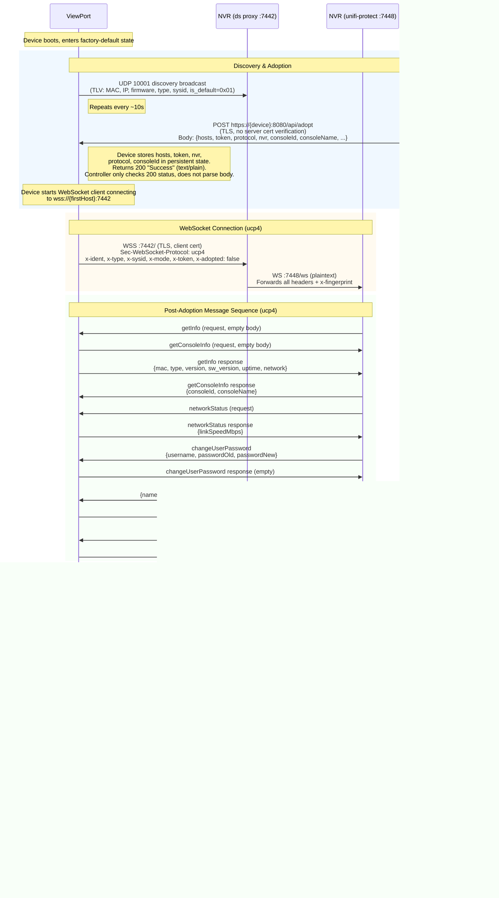

# Adoption Flow

> Status: Complete for the happy path. Error / retry paths are not fully captured.

```mermaid
sequenceDiagram
    participant Device as ViewPort
    participant DS as NVR (ds proxy :7442)
    participant Backend as NVR (unifi-protect :7448)
    participant NVR8080 as NVR (:8080)

    Note over Device: Device boots, enters factory-default state

    rect rgb(240, 248, 255)
        Note over Device,NVR8080: Discovery & Adoption
        Device->>DS: UDP 10001 discovery broadcast<br/>(TLV: MAC, IP, firmware, type, sysid, is_default=0x01)
        Note right of Device: Repeats every ~10s
        NVR8080->>Device: POST https://{device}:8080/api/adopt<br/>(TLS, no server cert verification)<br/>Body: {hosts, token, protocol, nvr, consoleId, consoleName, ...}
        Note right of Device: Device stores hosts, token, nvr,<br/>protocol, consoleId in persistent state.<br/>Returns 200 "Success" (text/plain).<br/>Controller only checks 200 status, does not parse body.
        Note over Device: Device starts WebSocket client connecting<br/>to wss://{firstHost}:7442
    end

    rect rgb(255, 250, 240)
        Note over Device,Backend: WebSocket Connection (ucp4)
        Device->>DS: WSS :7442/ (TLS, client cert)<br/>Sec-WebSocket-Protocol: ucp4<br/>x-ident, x-type, x-sysid, x-mode, x-token, x-adopted: false
        DS->>Backend: WS :7448/ws (plaintext)<br/>Forwards all headers + x-fingerprint
    end

    rect rgb(248, 255, 248)
        Note over Device,Backend: Post-Adoption Message Sequence (ucp4)
        Backend->>Device: getInfo (request, empty body)
        Device->>Backend: getConsoleInfo (request, empty body)
        Device->>Backend: getInfo response<br/>{mac, type, version, sw_version, uptime, network}
        Backend->>Device: getConsoleInfo response<br/>{consoleId, consoleName}
        Backend->>Device: networkStatus (request)
        Device->>Backend: networkStatus response<br/>{linkSpeedMbps}
        Backend->>Device: changeUserPassword<br/>{username, passwordOld, passwordNew}
        Device->>Backend: changeUserPassword response (empty)
        Backend->>Device: configure<br/>{name, nvr, streamProtocol, streamPort, liveview, cameras[]}
        Device->>Backend: configure response (empty)
        Backend->>Device: enableUpdatesChannel<br/>{uri: "wss://NVR:7442", lastUpdateId}
        Device->>Backend: enableUpdatesChannel response (empty)
    end

    rect rgb(255, 248, 255)
        Note over Device,Backend: Stream Alias Requests (ucp4)
        loop For each camera in liveview
            Device->>Backend: getStreamAlias<br/>{camera, channel, type: "ubv"}
            Backend->>Device: getStreamAlias response<br/>{alias, url, rtspUrl}
        end
    end

    rect rgb(240, 255, 240)
        Note over Device,DS: Updates Channel (second WebSocket)
        Device->>DS: WSS :7442/?lastUpdateId=...<br/>Sec-WebSocket-Protocol: updates<br/>Same x-ident, x-type, x-mode headers<br/>(no x-guid on this channel)
        DS->>Backend: WS :7448/ws (plaintext)
        Note over Device,Backend: Push notifications for camera state changes<br/>(update messages with modelKey="camera", modifiedKeys)
    end

    rect rgb(255, 240, 240)
        Note over Device: Stream Pull (port 7446)
        Device->>DS: WSS :7446/{alias}?type=ubv
        DS-->>Device: Camera livestream data (ubv frames)
    end

    Note over Device: Discovery continues (is_default=0x00,<br/>includes controller ID TLV 0x26)
```
